```mermaid
%%{ init: { "theme": "default", "themeVariables": { "background": "#ffffff", "lineColor": "rgba(15, 155, 26, 3)", "fontColor": "#0f0f0f5b" }, "flowchart": { "curve": "linear" } } }%%
graph TD
  Start[START] --> Random[Master Pomp
  Random 20-M1 or 20-M2 <-Master Pomp]-->
  Flow[Flow>=300]-->Check{Czy warunek A?}
  Check -- Tak --> Action1[Wykonaj akcję A]
  Check -- Nie --> Action2[Wykonaj akcję B]
  Action1 --> End[STOP]
  Action2 --> End
```

## 🔹 Check Level of Water Tank; 
##    def-> level_of_water(Ls, Tw)
```tefcha
try
    call: \nCheck Level
    if Ls>=20-BL1
        OPEN 20-K5
        while Ls>=20-BL1
            if Tw>=Ts
            else
                set: \nERROR:=True
                break  
    if if 20-K5 is OPEN
        CLOSE 20-K5    

except
    
    if ERROR==True
    Failed attempt\n fill of water tank 
    if if 20-K5 is OPEN
        CLOSE 20-K5 
Return: \nFlag_Level
end
```
## 🔹 Fill System of Water
##  def-> fill_system_of_water(Pm, Ppa, Ppr, Tw, T1)
```tefcha
try
    try
        call: \nCheck if system\n is empty

        if Pm>20-BP1 && Pm>20-BP2
            OPEN 20-K2 \n\nOPEN 20-K8

            while Ppa>20-BP1 && Ppa>20-BP2 
                if Tw>Ts
                    set: \nERROR:=True
                    break    

            CLOSE 20-K2

    except
        if ERROR==True
            Cooling system \nis not empty, \ndoesn't ability to empty
        if if 20-K2 is OPEN
            CLOSE 20-K2    

    try
        call: \nFill of System

        
        OPEN 20-K8
        START 20-M3
        call: \n Delay(T1)
        20-K8 CLOSE
            
        while Ppr>20-PB2
            if Tw>Ts
                set: \nERROR:=True
                break
        STOP 20-M3
 
    except
        if ERROR==True
            Failed attept\n fill of system
        
        STOP 20-M3
        if if 20-K8 is OPEN
            CLOSE 20-K8

except

    if if 20-M3 is RUN
        STOP 20-M3
    if if 20-K2 is CLOSE
        OPEN 20-K2
    if if 20-K8 is CLOSE
        OPEN 20-K8
Return: \nFlag_Filling   
end
```

## 🔹 Pressure Air Test
##  def-> pressure air test(Ps, Pda, Twa Td, Ts1)
```tefcha
call: \nPressure Air Test
try
    OPEN 20-K6
    while Ps>20-BP1
        if Twa>Ts1
            set: \nERROR:=True
            break

    CLOSE 20-K6

    # Pta - wyliczone minimalne ciśnienie w UUT po zakończeniu testu. 
    Pta:=20-PB1 - Pda

    # Td - czas potrzebny na stabilizacje ciśnienienia
    call: \nDelay(Td)

    if Pta<=20-BP1
        set: \nAir Test Result:=Pass

    else
        set: \nAir Test Result:=FAILED
 

except
    if ERROR==True
    set Pressure Air Test: None
    if if 20-K6 is OPEN
        CLOSE 20-K6
    OPEN 20-K2 \nDelay T:=Ts1 \nCLOSE 20-K2  
Return: Flag_ATerst_Result 
end
```

## 🔹 Pressure Water Test
##  def-> pressure water test(Ppa, Pd, Tw, Td, Ts1)
```tefcha
call: \nWater test presure
try

    while Ppa<20-BP1
        if 20-M3 is STOP
            START 20-M3
        if Tw>=Ts
            set: \nERROR:=True
            break
    STOP 20-M3
    ∆P:=20-BP1-Pd
    call: \nDelay(Td)
    if ∆P<=20-PB1
        set: \nWater Test Result:=Pass
    else
        set: \nWater Test Result:=FAILED
except
    if ERROR==True
    set Pressure Water Test: None
    if if 20-M3 is RUN
        STOP 20-M3
    OPEN 20-K2 \nDelay T:=Ts1 \nCLOSE 20-K2  
Return: Flag_WTest_Result
end
```


## 🔹 Filter Degree of Clogging: Warning 
##  def-> check_of _filter(Ps)
```tefcha
try
    Check of Filter
    while 20-M1 is RUN
        ∆P:=(20-BP2 - 20-PB3)
        if ∆P>Ps 
            Warning:= Rinsing of Filter 
        else
            Warning:= None
        break
except
    Pressure measurement ERROR

Return: Flag_FiltrStatus
end
```

## 🔹 Filter Degree of Clogging
##  def-> degree_of_cligging(Tc)
```tefcha
try

    if Flag: Filtr Status  
        if Test is STOPED
            if Push Button\n START Rinsing 
                Locked Start of Test
                OPEN 20-M_Filter
                Delay:=Tc
                CLOSE 20-K9
                Unlocked Start of Test
                Warning: None

except
    Manual stopped
    if if 20-K9 is OPEN
        CLOSE 20-K9
Return: CleaningStatus     
end
```

## 🔹 Setting and controlling flow 
##  def-> flow_control(Fn, Is, Fmin, Fmax, F)
```tefcha
Start
Set Vmin = wartość_minimalna_startu
Set Vn   = zadana_wartość_przepływu
Randomly select LeadPump from {M1, M2}
Set StandbyPump = other pump

Start LeadPump
Set current_signal to Vmin
Activate PID regulator for LeadPump with feedback from flowmeter

if Vn <= 300 then
    while current_flow < Vn
        RampUp current_signal gradually to achieve Vn
    end
    Stop StandbyPump
else
    Start StandbyPump
    Set current_signal_Standby = Vmin
    Activate PID regulator for StandbyPump with feedback from flowmeter

    while combined_flow < Vn
        RampUp current_signal and current_signal_Standby gradually to achieve Vn
    end
end

Monitor pumps and flow continuously

Stop
```

