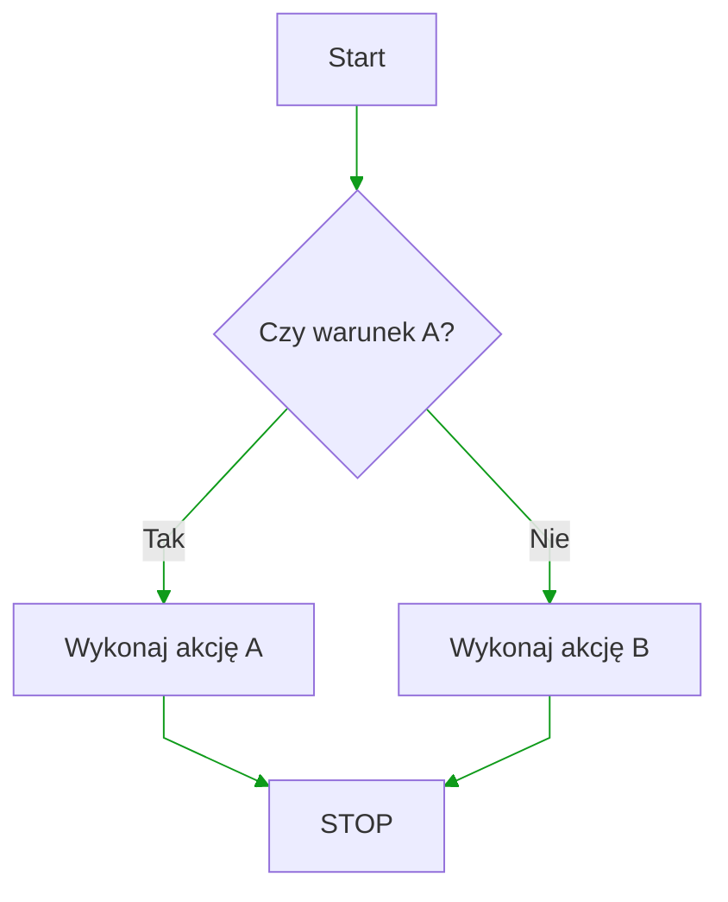

```mermaid
%%{ init: { "theme": "default", "themeVariables": { "background": "#ffffff", "lineColor": "rgba(15, 155, 26, 3)", "fontColor": "#0f0f0f5b" }, "flowchart": { "curve": "linear" } } }%%
graph TD
  Start[Start] --> Check{Czy warunek A?}
  Check -- Tak --> Action1[Wykonaj akcję A]
  Check -- Nie --> Action2[Wykonaj akcję B]
  Action1 --> End[STOP]
  Action2 --> End
```